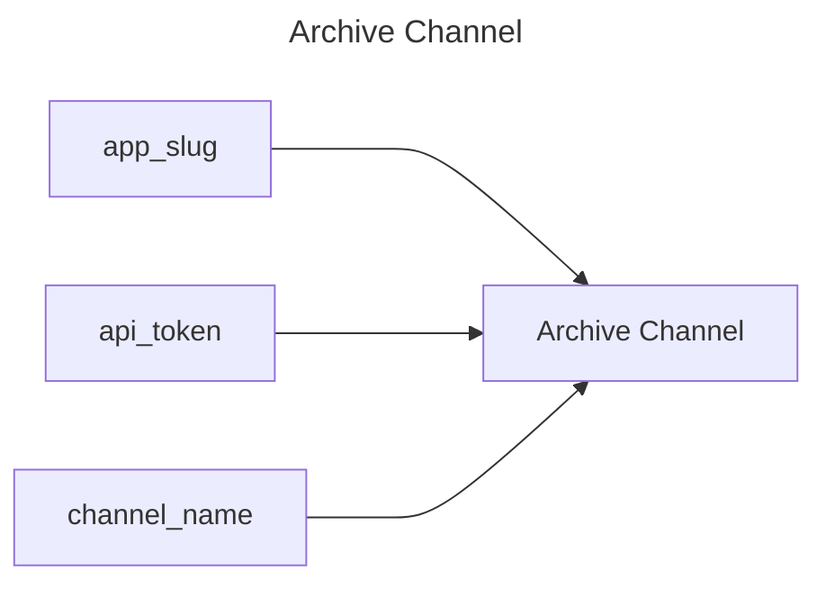

## Archive Channel

## Inputs
| Name | Default | Required | Description |
| --- | --- | --- | --- |
| app-slug |  | True | App Slug. |
| api-token |  | True | API Token. |
| channel-name |  | True | The name of the channel to archive. |

## Outputs
| Name | Description |
| --- | --- |

