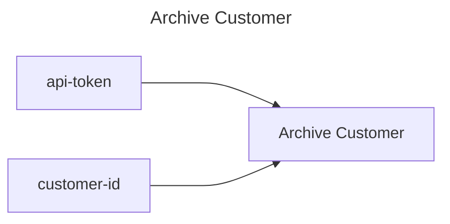

## Archive Customer

## Inputs
| Name | Default | Required | Description |
| --- | --- | --- | --- |
| api-token |  | True | API Token. |
| customer-id |  | True | The id of the customer. |

## Outputs
| Name | Description |
| --- | --- |

