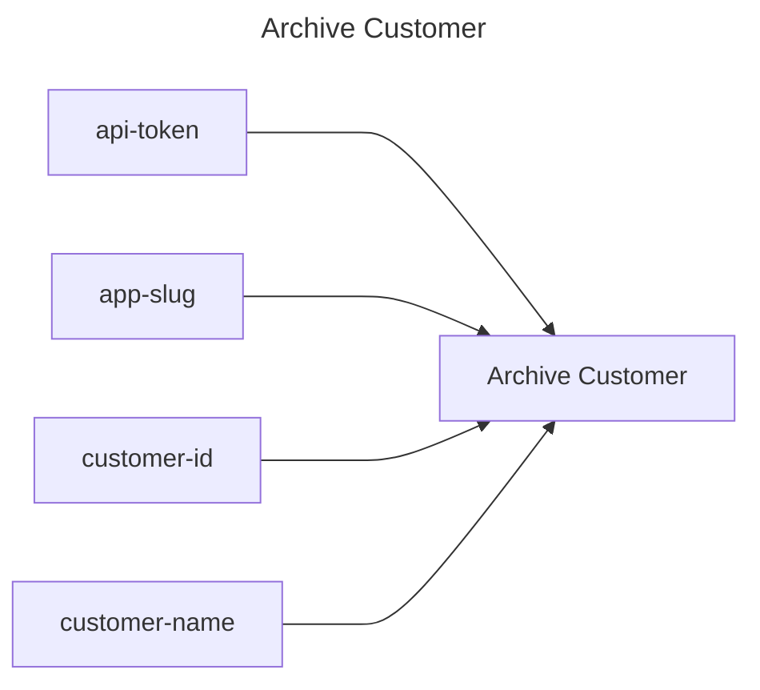

## Archive Customer

## Inputs
| Name | Default | Required | Description |
| --- | --- | --- | --- |
| api-token |  | True | API Token. |
| app-slug |  | True | App Slug. |
| customer-id |  | False | The id of the customer. Either customer-id or customer-name must be provided. |
| customer-name |  | False | The name of the customer. If provided, will look up the customer ID. Either customer-id or customer-name must be provided. |

## Outputs
| Name | Description |
| --- | --- |

