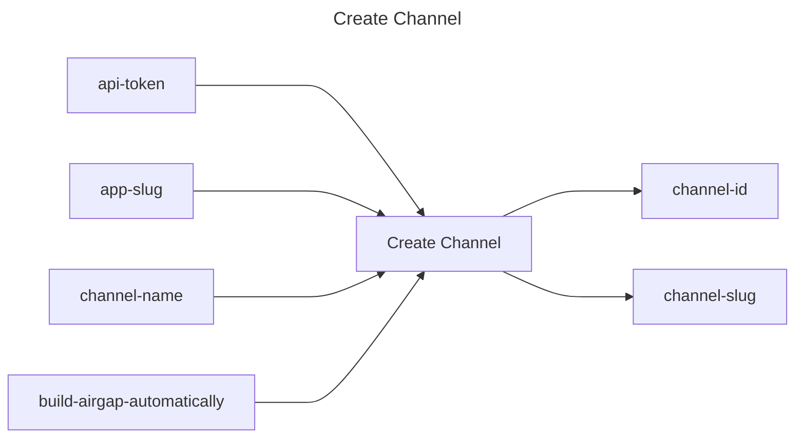

## Create Channel

## Inputs
| Name | Default | Required | Description |
| --- | --- | --- | --- |
| api-token |  | True | API Token. |
| app-slug |  | True | App Slug. |
| channel-name |  | True | The name of the channel to create. |
| build-airgap-automatically | false | False | Build airgap bundles automatically for releases promoted to this channel. |

## Outputs
| Name | Description |
| --- | --- |
| channel-id | Contains the channel id. |
| channel-slug | Contains the channel slug. |

