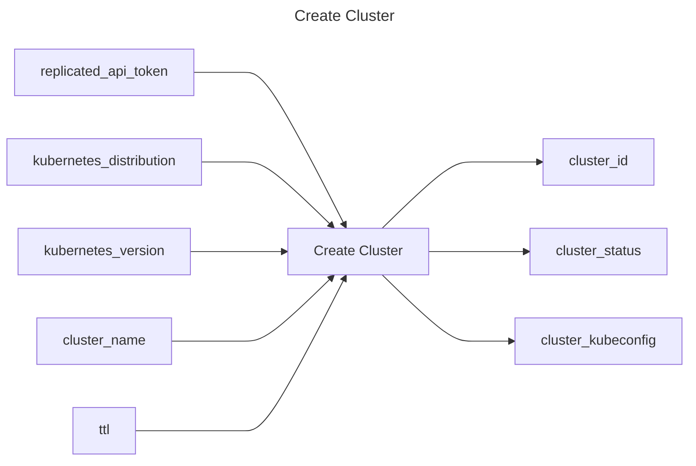

# Create a cluster

```mermaid
---
title: Create Cluster
---
graph LR
create_cluster["Create Cluster"]
replicated_api_token ---> create_cluster
kubernetes_distribution ---> create_cluster
kubernetes_version ---> create_cluster
cluster_name ---> create_cluster
ttl ---> create_cluster
create_cluster ---> cluster_id
create_cluster ---> cluster_status
create_cluster ---> cluster_kubeconfig
```
