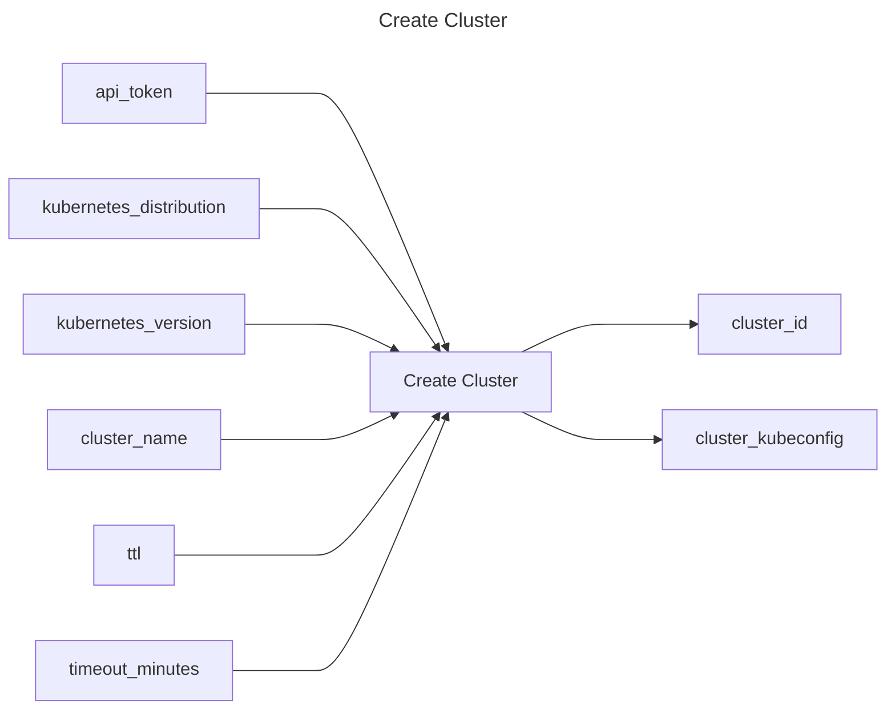

## Create Cluster

## Inputs
| Name | Default | Required | Description |
| --- | --- | --- | --- |
| api-token |  | True | API Token. |
| kubernetes-distribution |  | True | Kubernetes distribution of the cluster to provision. |
| kubernetes-version |  | True | Kubernetes version to provision (format is distribution dependent). |
| cluster-name |  | True | Name of the cluster to provision |
| ttl |  | False | Cluster TTL (duration, max 48h) |
| timeout-minutes | 20 | False | Time to wait for the cluster to have a status of `running` |

## Outputs
| Name | Description |
| --- | --- |
| cluster-id | Contains the cluster id. |
| cluster-kubeconfig | Contains the kubeconfig to connect with the cluster. |

