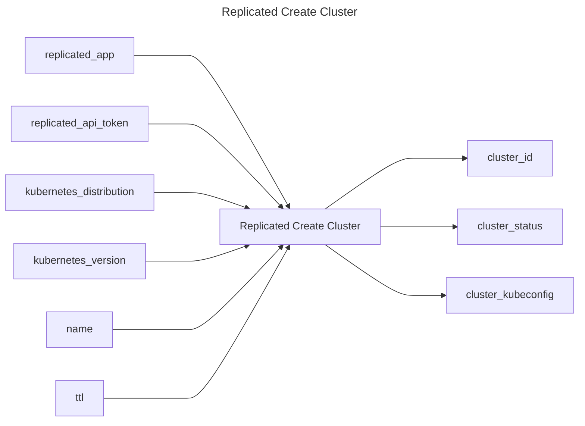

# Create a cluster

This is a composite actions consisting of the following actions:
* Create a cluster using the CLI
* Wait for the cluster to be running
* Get the kubeconfig for the cluster

```mermaid
---
title: Replicated Create Cluster
---
graph LR
replicated_create_cluster["Replicated Create Cluster"]
replicated_app ---> replicated_create_cluster
replicated_api_token ---> replicated_create_cluster
kubernetes_distribution ---> replicated_create_cluster
kubernetes_version ---> replicated_create_cluster
name ---> replicated_create_cluster
ttl ---> replicated_create_cluster
replicated_create_cluster ---> cluster_id
replicated_create_cluster ---> cluster_status
replicated_create_cluster ---> cluster_kubeconfig
```
