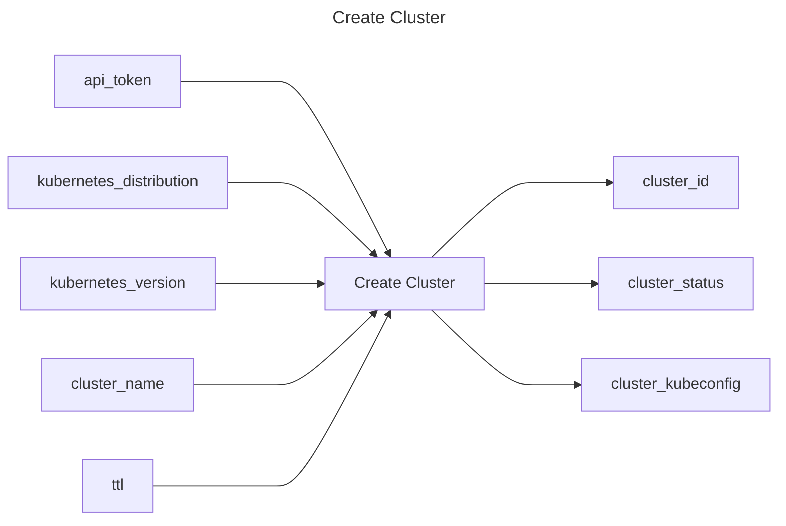

## Create Cluster

## Inputs
| Name | Default | Required | Description |
| --- | --- | --- | --- |
| api-token |  | True | API Token. |
| kubernetes-distribution | kind | True | Kubernetes distribution of the cluster to provision (default "kind") |
| kubernetes-version | v1.25.3 | True | Kubernetes version to provision (format is distribution dependent) (default "v1.25.3") |
| cluster-name |  | True | Name of the cluster to provision |
| ttl | 1h | True | Cluster TTL (duration) (default "1h") |

## Outputs
| Name | Description |
| --- | --- |
| cluster-id | Contains the cluster id. |
| cluster-status | Contains the cluster status. |
| cluster-kubeconfig | Contains the kubeconfig to connect with the cluster. |

