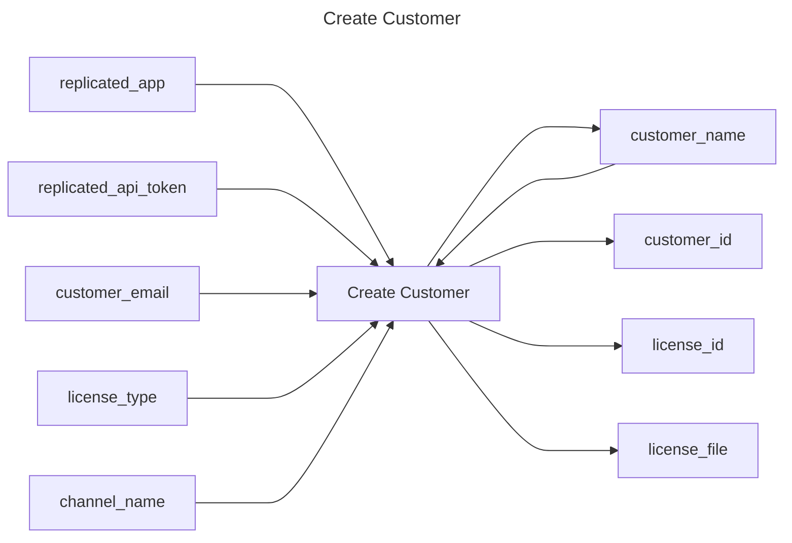

# Create Customer

## Inputs
| Name | Default | Required | Description |
| --- | --- | --- | --- |
| replicated-app |  | True | Replicated App Slug. |
| replicated-api-token |  | True | Replicated API Token. |
| customer-name |  | True | Name of the customer. |
| customer-email |  | False | Email of the customer. |
| license-type | dev | True | License Type for the customer. |
| channel-name | ${GITHUB_REF} | True | Channel to assign the customer to. |

## Outputs
| Name | Description |
| --- | --- |
| customer-name | Contains the customer name. |
| customer-id | Contains the customer id. |
| license-id | Contains the license id. |
| license-file | Contains he license file. |