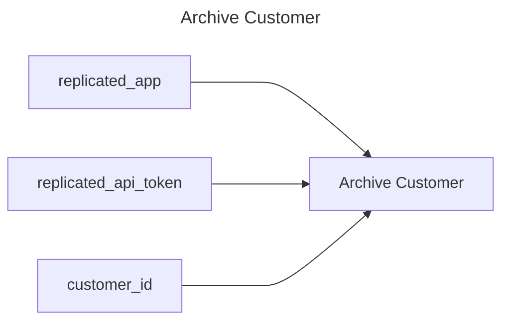

# Create Customer

```mermaid
---
title: Archive Customer
---
graph LR
archive_customer["Archive Customer"]
replicated_app ---> archive_customer
replicated_api_token ---> archive_customer
customer_id ---> archive_customer
```