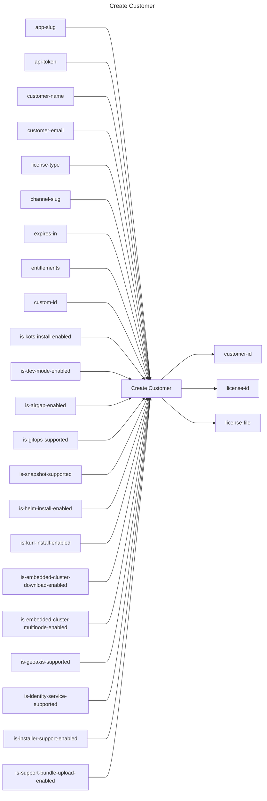

## Create Customer

```mermaid
---
title: Create Customer
---
graph LR
create_customer["Create Customer"]
app_slug["app-slug"]
api_token["api-token"]
customer_name["customer-name"]
customer_email["customer-email"]
license_type["license-type"]
channel_slug["channel-slug"]
expires_in["expires-in"]
entitlements["entitlements"]
custom_id["custom-id"]
is_kots_install_enabled["is-kots-install-enabled"]
is_dev_mode_enabled["is-dev-mode-enabled"]
is_airgap_enabled["is-airgap-enabled"]
is_gitops_supported["is-gitops-supported"]
is_snapshot_supported["is-snapshot-supported"]
is_helm_install_enabled["is-helm-install-enabled"]
is_kurl_install_enabled["is-kurl-install-enabled"]
is_embedded_cluster_download_enabled["is-embedded-cluster-download-enabled"]
is_embedded_cluster_multinode_enabled["is-embedded-cluster-multinode-enabled"]
is_geoaxis_supported["is-geoaxis-supported"]
is_identity_service_supported["is-identity-service-supported"]
is_installer_support_enabled["is-installer-support-enabled"]
is_support_bundle_upload_enabled["is-support-bundle-upload-enabled"]
customer_id["customer-id"]
license_id["license-id"]
license_file["license-file"]
app_slug ---> create_customer
api_token ---> create_customer
customer_name ---> create_customer
customer_email ---> create_customer
license_type ---> create_customer
channel_slug ---> create_customer
expires_in ---> create_customer
entitlements ---> create_customer
custom_id ---> create_customer
is_kots_install_enabled ---> create_customer
is_dev_mode_enabled ---> create_customer
is_airgap_enabled ---> create_customer
is_gitops_supported ---> create_customer
is_snapshot_supported ---> create_customer
is_helm_install_enabled ---> create_customer
is_kurl_install_enabled ---> create_customer
is_embedded_cluster_download_enabled ---> create_customer
is_embedded_cluster_multinode_enabled ---> create_customer
is_geoaxis_supported ---> create_customer
is_identity_service_supported ---> create_customer
is_installer_support_enabled ---> create_customer
is_support_bundle_upload_enabled ---> create_customer
create_customer ---> customer_id
create_customer ---> license_id
create_customer ---> license_file
```
## Inputs
| Name | Default | Required | Description |
| --- | --- | --- | --- |
| app-slug |  | True | App Slug. |
| api-token |  | True | API Token. |
| customer-name |  | True | Name of the customer. |
| customer-email |  | False | Email of the customer. |
| license-type | dev | True | License Type for the customer. |
| channel-slug |  | False | Channel to assign the customer to. |
| expires-in | 0 | False | Expiration of the license in days. (default: 0 - never expires)) |
| entitlements |  | False | Entitlements to assign to the customer. Example: <pre>entitlements: \|   - name: "number-of-users"     value: "10"</pre>  |
| custom-id |  | False | Custom ID to assign to the customer. |
| is-kots-install-enabled |  | False | If KOTS install should be enabled for the customer. |
| is-dev-mode-enabled |  | False | If Dev Mode should be enabled for the customer. Can only be enabled for dev licenses. |
| is-airgap-enabled |  | False | If airgap installs should be enabled for the customer. |
| is-gitops-supported |  | False | If GitOps should be supported for the customer. |
| is-snapshot-supported |  | False | If snapshots should be supported for the customer. |
| is-helm-install-enabled |  | False | If Helm installs should be enabled for the customer. |
| is-kurl-install-enabled |  | False | If kURL installs should be enabled for the customer. |
| is-embedded-cluster-download-enabled |  | False | If Embedded Cluster downloads should be enabled for the customer. |
| is-embedded-cluster-multinode-enabled |  | False | If Embedded Cluster multi-node should be enabled for the customer. |
| is-geoaxis-supported |  | False | If GeoAxis should be supported for the customer. |
| is-identity-service-supported |  | False | If the Identity Service should be supported for the customer. |
| is-installer-support-enabled |  | False | If installer support should be enabled for the customer. |
| is-support-bundle-upload-enabled |  | False | If support bundle uploads should be enabled for the customer. |

## Outputs
| Name | Description |
| --- | --- |
| customer-id | Contains the customer id. |
| license-id | Contains the license id. |
| license-file | Contains he license file. |

