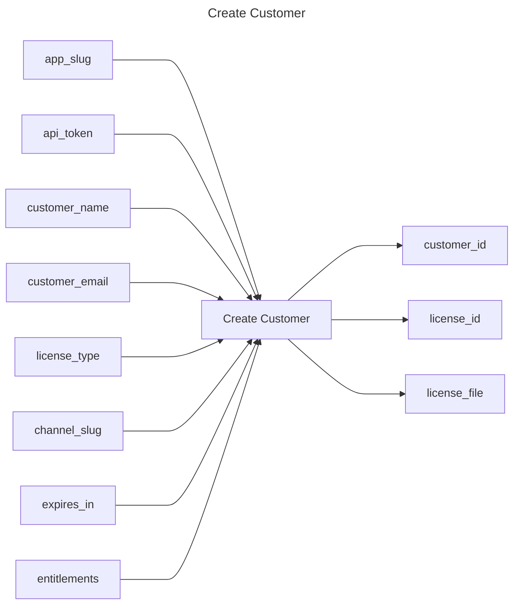

## Create Customer

## Inputs
| Name | Default | Required | Description |
| --- | --- | --- | --- |
| app-slug |  | True | App Slug. |
| api-token |  | True | API Token. |
| customer-name |  | True | Name of the customer. |
| customer-email |  | False | Email of the customer. |
| license-type | dev | True | License Type for the customer. |
| channel-slug |  | False | Channel to assign the customer to. |
| expires-in | 0 | False | Expiration of the license in days. (default: 0 - never expires)) |
| entitlements |  | False | Entitlements to assign to the customer. |

## Outputs
| Name | Description |
| --- | --- |
| customer-id | Contains the customer id. |
| license-id | Contains the license id. |
| license-file | Contains he license file. |

