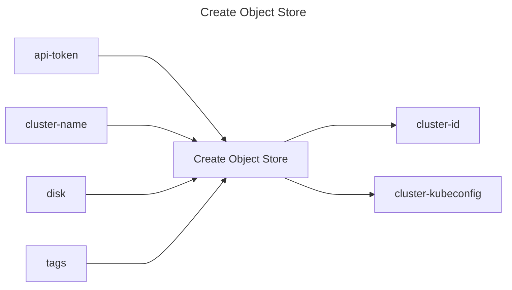

## Create Object Store

## Inputs
| Name | Default | Required | Description |
| --- | --- | --- | --- |
| api-token |  | True | API Token. |
| cluster-name |  | True | Name of the cluster to provision |
| disk |  | False | Disk size in GiB |
| tags |  | False | Tags to assign to the cluster. Example: <pre>tags: \|   - key: "department"     value: "engineering"</pre>  |

## Outputs
| Name | Description |
| --- | --- |
| cluster-id | Contains the cluster id. |
| cluster-kubeconfig | Contains the kubeconfig to connect with the cluster. |

