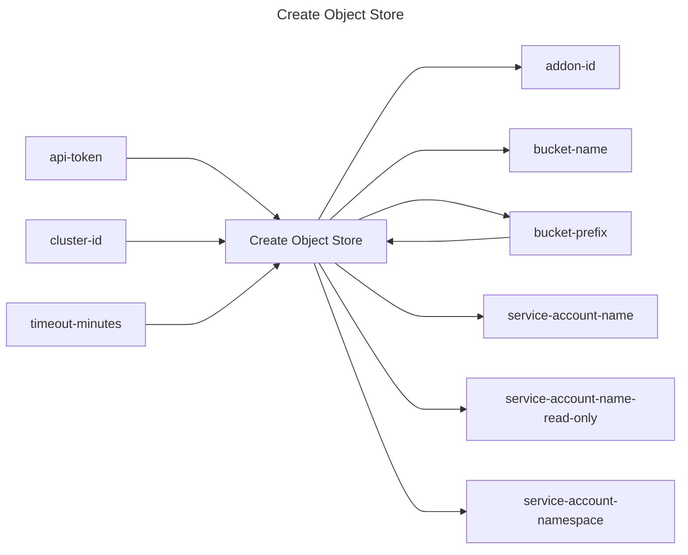

## Create Object Store

## Inputs
| Name | Default | Required | Description |
| --- | --- | --- | --- |
| api-token |  | True | API Token. |
| cluster-id |  | True | Cluster id to attach object store to |
| bucket-prefix |  | True | A prefix for the bucket name to be created. |
| timeout-minutes | 20 | False | Time to wait for the object store to have a status of `ready` |

## Outputs
| Name | Description |
| --- | --- |
| addon-id | Contains the id of the addon. |
| bucket-name | Contains the final bucket name. |
| bucket-prefix | Contains the prefix of the bucket. |
| service-account-name | Contains the name of the service account. |
| service-account-name-read-only | Contains the name of the read only service account. |
| service-account-namespace | Contains the namespace of the service account. |

