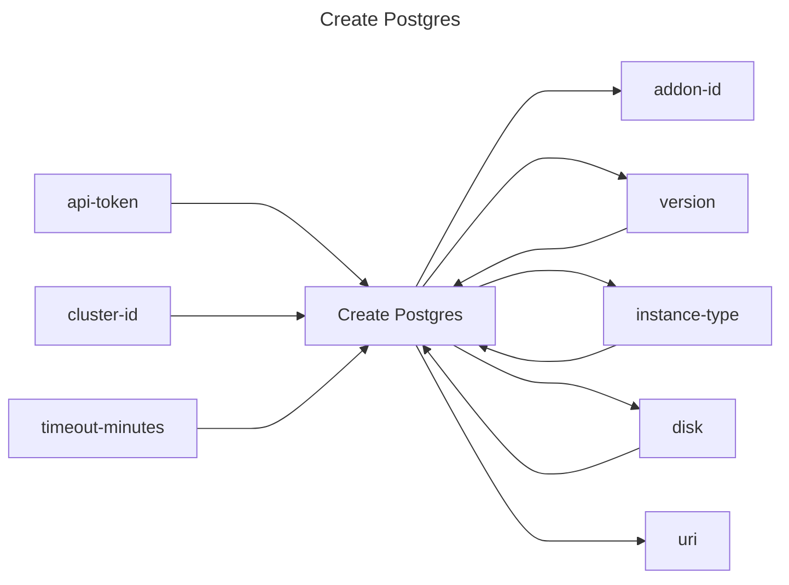

## Create Postgres

## Inputs
| Name | Default | Required | Description |
| --- | --- | --- | --- |
| api-token |  | True | API Token. |
| cluster-id |  | True | Cluster id to attach postgres to |
| version |  | False | Postgres version to provision. |
| instance-type |  | False | Instance type to provision |
| disk |  | False | Disk size in GiB |
| timeout-minutes | 10 | False | Time to wait for the postgres to have a status of `ready` |

## Outputs
| Name | Description |
| --- | --- |
| addon-id | Contains the id of the addon. |
| version | Contains the provisioned postgres version. |
| instance-type | Contains the instance type of postgres. |
| disk | Contains the disk size of postgres. |
| uri | Contains the URI of the postgres to connect to. |

