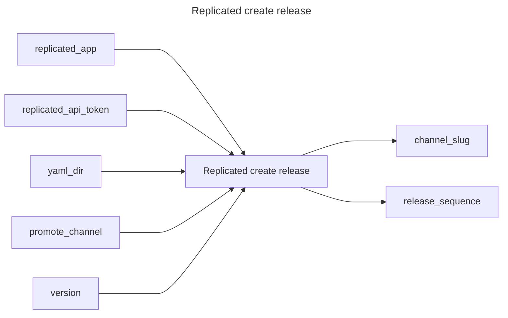

# Create Release

## Inputs
| Name | Default | Required | Description |
| --- | --- | --- | --- |
| replicated-app |  | True | Replicated App Slug. |
| replicated-api-token |  | True | Replicated API Token. |
| yaml-dir | manifests | True | The directory containing multiple yamls for a Replicated release. |
| promote-channel | ${GITHUB_REF} | True | Channel name or id to promote this release to. |
| version | ${GITHUB_SHA::7} | True | Release version |

## Outputs
| Name | Description |
| --- | --- |
| channel-slug | Contains the channel slug. |
| release-sequence | Sequence number of the release. |