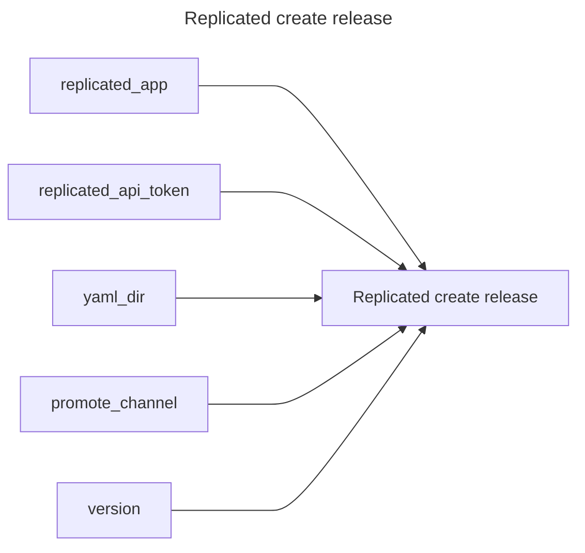

# Create Release

```mermaid
---
title: Replicated create release
---
graph LR
replicated_create_release["Replicated create release"]
replicated_app ---> replicated_create_release
replicated_api_token ---> replicated_create_release
yaml_dir ---> replicated_create_release
promote_channel ---> replicated_create_release
version ---> replicated_create_release
```