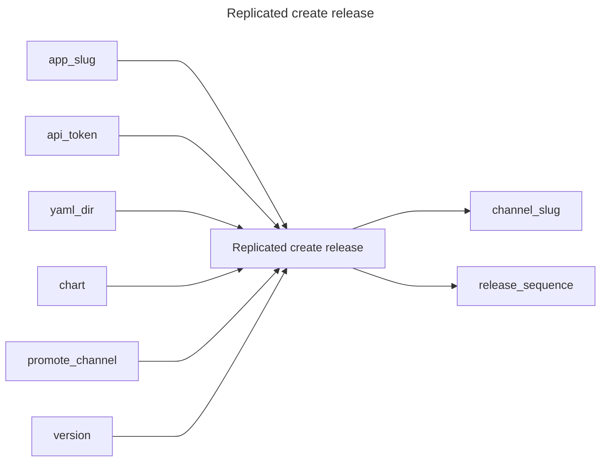

## Replicated create release

## Inputs
| Name | Default | Required | Description |
| --- | --- | --- | --- |
| app-slug |  | True | App Slug. |
| api-token |  | True | API Token. |
| yaml-dir | manifests | False | The directory containing multiple yamls for a Replicated release. |
| chart |  | False | The Helm chart tarball for a Replicated release |
| promote-channel |  | False | Channel name or id to promote this release to. |
| version | ${GITHUB_SHA::7} | False | Release version |

## Outputs
| Name | Description |
| --- | --- |
| channel-slug | Contains the channel slug. |
| release-sequence | Sequence number of the release. |

