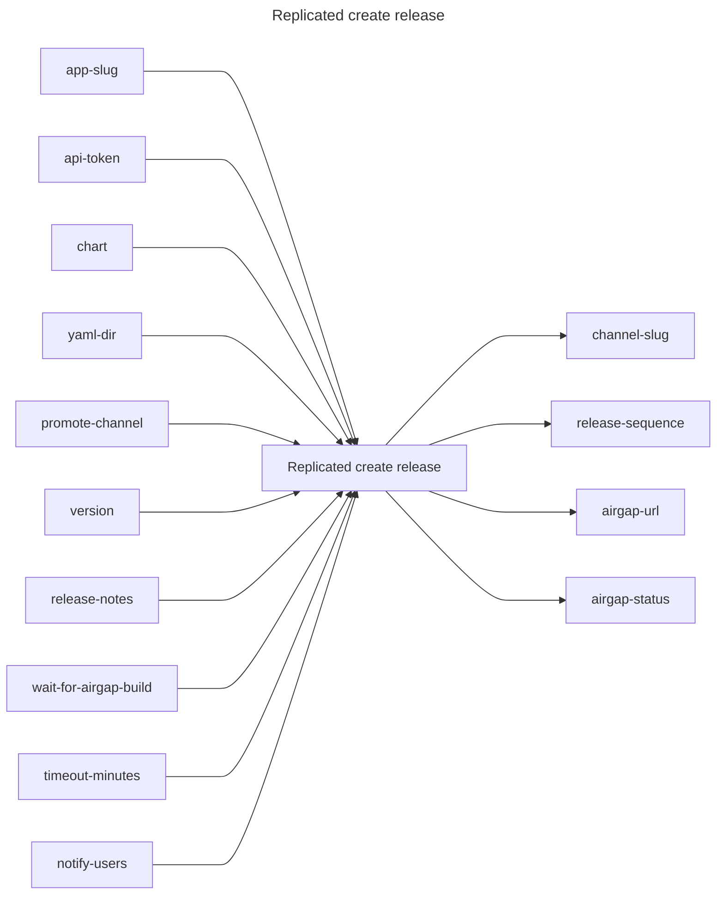

## Replicated create release


```mermaid
---
title: Replicated create release
---
graph LR
replicated_create_release["Replicated create release"]
app_slug["app-slug"]
api_token["api-token"]
chart["chart"]
yaml_dir["yaml-dir"]
promote_channel["promote-channel"]
version["version"]
release_notes["release-notes"]
wait_for_airgap_build["wait-for-airgap-build"]
timeout_minutes["timeout-minutes"]
notify_users["notify-users"]
channel_slug["channel-slug"]
release_sequence["release-sequence"]
airgap_url["airgap-url"]
airgap_status["airgap-status"]
app_slug ---> replicated_create_release
api_token ---> replicated_create_release
chart ---> replicated_create_release
yaml_dir ---> replicated_create_release
promote_channel ---> replicated_create_release
version ---> replicated_create_release
release_notes ---> replicated_create_release
wait_for_airgap_build ---> replicated_create_release
timeout_minutes ---> replicated_create_release
notify_users ---> replicated_create_release
replicated_create_release ---> channel_slug
replicated_create_release ---> release_sequence
replicated_create_release ---> airgap_url
replicated_create_release ---> airgap_status
```
## Inputs
| Name | Default | Required | Description |
| --- | --- | --- | --- |
| app-slug |  | False | App Slug. Required unless .replicated config file specifies appSlug. |
| api-token |  | True | API Token. |
| chart |  | False | Path to the helm chart. One of chart or yaml-dir is required, unless a .replicated config file is present. |
| yaml-dir |  | False | Directory containing multiple yamls. One of chart or yaml-dir is required, unless a .replicated config file is present. |
| promote-channel |  | False | Channel name or id to promote this release to. If not specified, the release will not be promoted. |
| version |  | False | Release version. This will be ignored if `promote-channel` is not specified. |
| release-notes |  | False | Release notes. This will be ignored if `promote-channel` is not specified. |
| wait-for-airgap-build |  | False | Wait for the airgap build status or not. Defaults to false. |
| timeout-minutes |  | False | Maximum time (in minutes) to wait for the airgap build to complete. Defaults to 20 minutes. |
| notify-users |  | False | Send a notification to channel subscribers when the release is promoted. Defaults to false. |

## Outputs
| Name | Description |
| --- | --- |
| channel-slug | Contains the channel slug. |
| release-sequence | Sequence number of the release. |
| airgap-url | Contains the download url of the airgap build, if promote-channel is enabled auto airgap builds. |
| airgap-status | Current build status of the airgap bundle, if promote-channel is enabled auto airgap builds. |

## .replicated config file auto-discovery

If neither `chart` nor `yaml-dir` is provided, the action automatically searches for a `.replicated` or `.replicated.yaml` config file starting from the current working directory and walking upward (matching the behavior of the Replicated CLI).

When a config file is found, the action:
- Derives `app-slug` from the config if not explicitly provided.
- Derives `promote-channel` from `promoteToChannelNames[0]` if not explicitly provided.
- Runs `helm dependency update` and `helm package . -d <staging>` for each chart in `config.charts`.
- Resolves manifest glob patterns and copies matching files into a temporary staging directory.
- Creates the release from the staged directory.

This requires `helm` to be available on the runner.

### Example `.replicated` file

```yaml
appSlug: my-app
charts:
  - path: ./chart
manifests:
  - ./manifests/*.yaml
promoteToChannelNames:
  - Unstable
```

