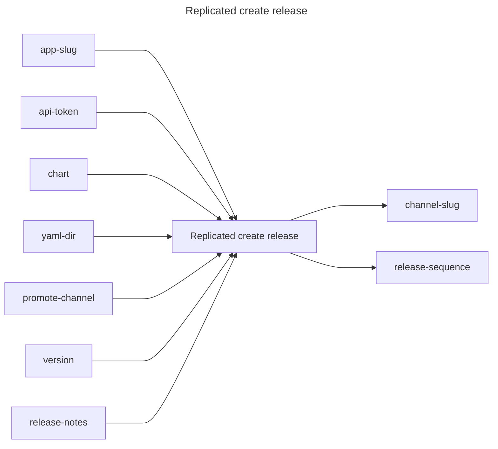

## Replicated create release

## Inputs
| Name | Default | Required | Description |
| --- | --- | --- | --- |
| app-slug |  | True | App Slug. |
| api-token |  | True | API Token. |
| chart |  | False | Path to the helm chart (One of `chart` or `yaml-dir` is required). |
| yaml-dir |  | False | The directory containing multiple yamls for a Replicated release (One of `chart` or `yaml-dir` is required). |
| promote-channel |  | False | Channel name or id to promote this release to. If not specified, the release will not be promoted. |
| version |  | False | Release version. This will be ignored if `promote-channel` is not specified. |
| release-notes |  | False | Release notes. This will be ignored if `promote-channel` is not specified. |

## Outputs
| Name | Description |
| --- | --- |
| channel-slug | Contains the channel slug. |
| release-sequence | Sequence number of the release. |

