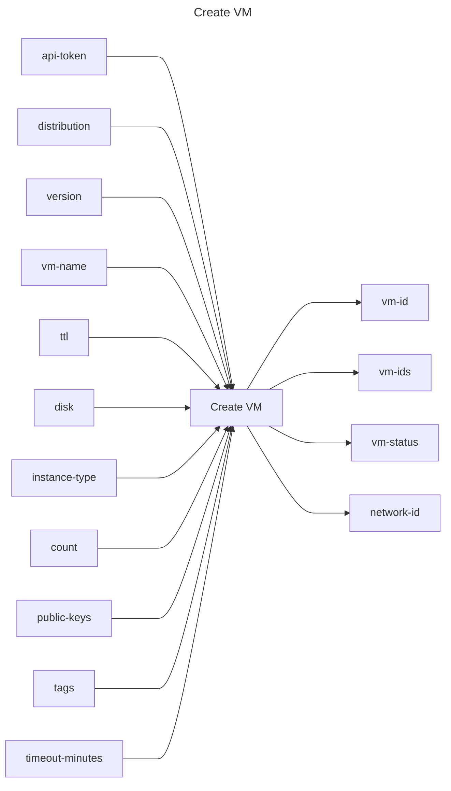

## Create VM

## Inputs
| Name | Default | Required | Description |
| --- | --- | --- | --- |
| api-token |  | True | API Token. |
| distribution |  | True | VM distribution to provision (e.g., ubuntu). |
| version |  | False | Distribution version to provision. |
| vm-name |  | False | Name of the VM to provision. |
| ttl |  | False | VM TTL (duration, max 48h) |
| disk |  | False | Disk size in GiB |
| instance-type |  | False | Instance type to provision |
| count |  | False | Number of VMs to provision |
| public-keys |  | False | SSH public keys to inject into the VM. Example: <pre>public-keys: \|   - "ssh-ed25519 AAAA... user@host"</pre>  |
| tags |  | False | Tags to assign to the VM. Example: <pre>tags: \|   - key: "department"     value: "engineering"</pre>  |
| timeout-minutes | 20 | False | Time to wait for the VM(s) to have a status of `running` |

## Outputs
| Name | Description |
| --- | --- |
| vm-id | Contains the first VM's id (convenient for count=1). |
| vm-ids | JSON array of all created VM ids. |
| vm-status | Final status of the first VM after polling. |
| network-id | Contains the network id associated with the first VM. |

