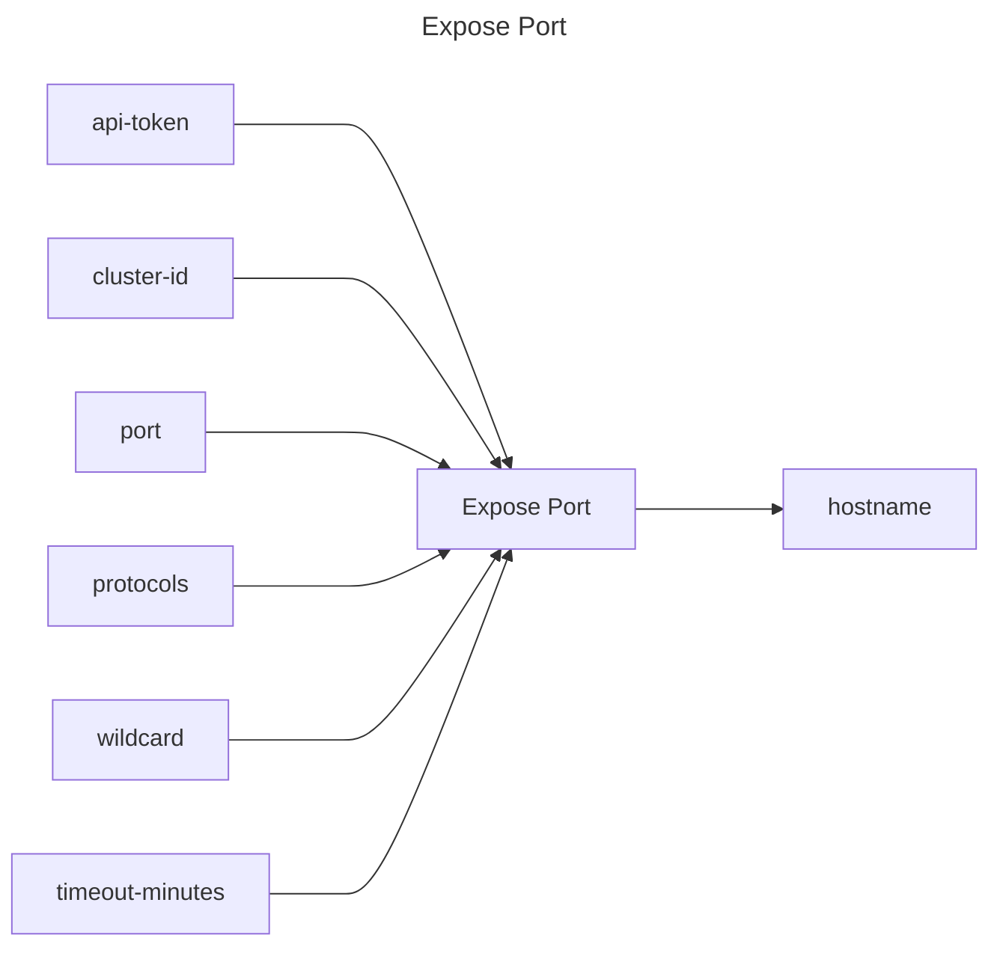

## Expose Port

## Inputs
| Name | Default | Required | Description |
| --- | --- | --- | --- |
| api-token |  | True | API Token. |
| cluster-id |  | True | Cluster id to expose port for |
| port |  | True | Cluster Port to expose. |
| protocols | https | False | Protocols to expose port for. Default is `https`. Possible values are `http`, `https`, `http,https`. |
| wildcard | false | False | Create a wildcard DNS entry and TLS certificate for this port (will take extra time to provision). |
| timeout-minutes | 5 | False | Time to wait for the port to have a status of `ready` |

## Outputs
| Name | Description |
| --- | --- |
| hostname | Contains the hostname of the exposed port. |

