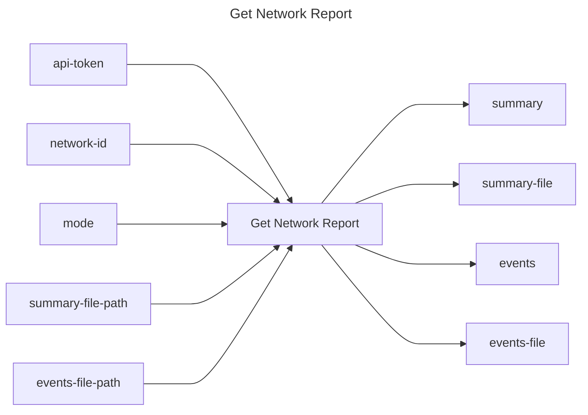

## Get Network Report

## Inputs
| Name | Default | Required | Description |
| --- | --- | --- | --- |
| api-token |  | True | API Token. |
| network-id |  | True | Network id. |
| mode |  | True | Report mode: `summary`, `events`, or `all`. NOTE: `summary` is only available after the network has been terminated (the cluster removed) and its events have been processed; calling it on a live network returns an error. |
| summary-file-path |  | False | If specified (and mode includes summary), the summary is written to this file path. Otherwise it is set as the `summary` action output variable. |
| events-file-path |  | False | If specified (and mode includes events), the events are written to this file path. Otherwise they are set as the `events` action output variable. Variable mode is capped at 1MB; use a file for larger event payloads. |

## Outputs
| Name | Description |
| --- | --- |
| summary | Summary of the network report (set when mode includes summary and `summary-file-path` is not provided). |
| summary-file | Path of the summary file (set when mode includes summary and `summary-file-path` is provided). |
| events | All the reported events from the network report (set when mode includes events and `events-file-path` is not provided). |
| events-file | Path of the events file (set when mode includes events and `events-file-path` is provided). |

