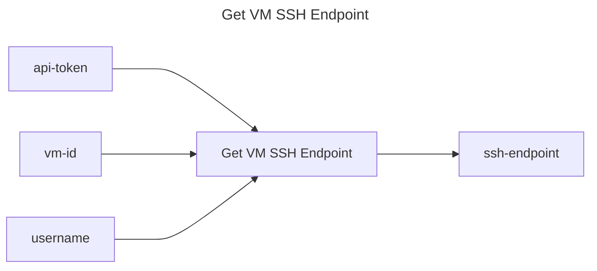

## Get VM SSH Endpoint

## Inputs
| Name | Default | Required | Description |
| --- | --- | --- | --- |
| api-token |  | True | API Token. |
| vm-id |  | True | The ID of the VM to get the SSH endpoint for. |
| username |  | False | Optional username to include in the SSH endpoint. |

## Outputs
| Name | Description |
| --- | --- |
| ssh-endpoint | Contains the SSH endpoint for the VM. |

