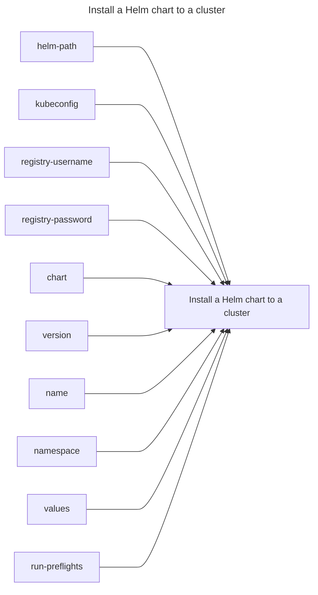

## Install a Helm chart to a cluster

## Inputs
| Name | Default | Required | Description |
| --- | --- | --- | --- |
| helm-path |  | True | The path to the helm binary to use |
| kubeconfig |  | True | A valid kubeconfig to connect to |
| registry-username |  | True | The registry username to log in with |
| registry-password |  | True | The registry password to use |
| chart |  | True | The chart to use |
| version |  | False | The version of the chart to install |
| name |  | True | The name of release to install |
| namespace |  | True | The namespace to install the application to |
| values |  | True | A values.yaml file to use |
| run-preflights | false | False | Run preflight checks (true/false) |

## Outputs
| Name | Description |
| --- | --- |

