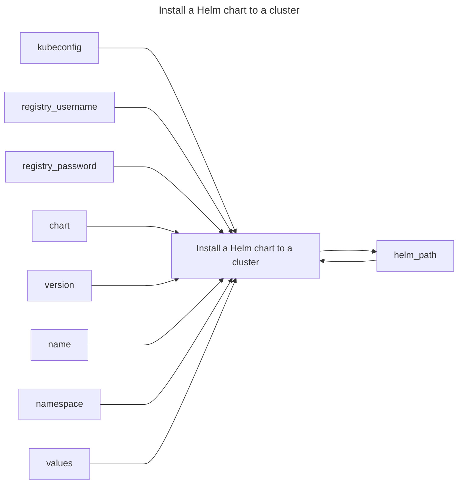

# Install app action

```mermaid
---
title: Install a Helm chart to a cluster
---
graph LR
install_a_helm_chart_to_a_cluster["Install a Helm chart to a cluster"]
helm_path ---> install_a_helm_chart_to_a_cluster
kubeconfig ---> install_a_helm_chart_to_a_cluster
registry_username ---> install_a_helm_chart_to_a_cluster
registry_password ---> install_a_helm_chart_to_a_cluster
chart ---> install_a_helm_chart_to_a_cluster
version ---> install_a_helm_chart_to_a_cluster
name ---> install_a_helm_chart_to_a_cluster
namespace ---> install_a_helm_chart_to_a_cluster
values ---> install_a_helm_chart_to_a_cluster
install_a_helm_chart_to_a_cluster ---> helm_path
```