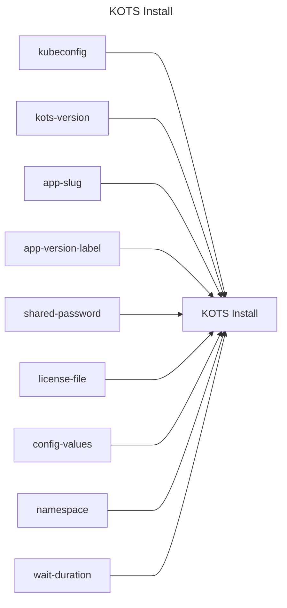

## KOTS Install

## Inputs
| Name | Default | Required | Description |
| --- | --- | --- | --- |
| kubeconfig |  | True | A valid kubeconfig to connect to |
| kots-version | latest | True | The version of KOTS to use |
| app-slug |  | True | App Slug. |
| app-version-label |  | False | The application version label to install. If not specified, the latest version is installed. |
| shared-password |  | False | Shared password to use when deploying the admin console. If not specified, a random password is generated. |
| license-file |  | True | A license.yaml to use. This can be a path to a file or the contents of the file. |
| config-values |  | False | The config values to use. This can be a path to a file or the contents of the file. |
| namespace | default | False | The namespace to install the application to |
| wait-duration |  | False | Timeout to be used while waiting for individual components to be ready. must be in Go duration format (eg: 10s, 2m) (default "2m") |

## Outputs
| Name | Description |
| --- | --- |

