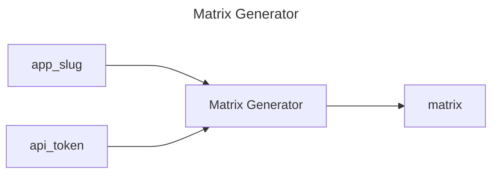

## Matrix Generator

## Inputs
| Name | Default | Required | Description |
| --- | --- | --- | --- |
| app-slug |  | True | App Slug. |
| api-token |  | True | API Token. |

## Outputs
| Name | Description |
| --- | --- |
| matrix | Matrix to test with (json). |

