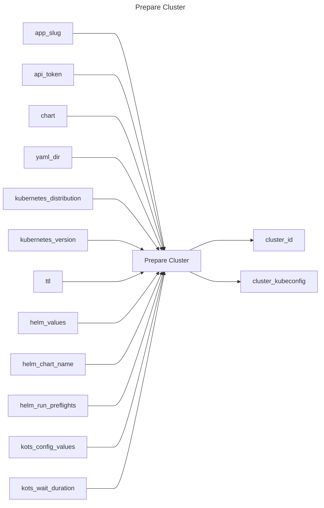

## Prepare Cluster

## Inputs
| Name | Default | Required | Description |
| --- | --- | --- | --- |
| app-slug |  | True | App Slug. |
| api-token |  | True | API Token. |
| chart |  | False | Path to the helm chart (One of `chart` or `yaml-dir` is required). |
| yaml-dir |  | False | The directory containing multiple yamls for a Replicated release. |
| kubernetes-distribution |  | True | Kubernetes distribution of the cluster to provision. |
| kubernetes-version |  | False | Kubernetes version to provision (format is distribution dependent). |
| ttl |  | False | Cluster TTL (duration, max 48h) |
| helm-values |  | False | A Helm values.yaml file to use |
| helm-chart-name |  | False | The name of the Helm chart to use |
| helm-run-preflights | true | False | Run preflight checks (true/false) |
| kots-config-values |  | False | The KOTS config values to use |
| kots-wait-duration |  | False | Timeout for KOTS to be used while waiting for individual components to be ready. must be in Go duration format (eg: 10s, 2m) (default "2m") |

## Outputs
| Name | Description |
| --- | --- |
| cluster-id | Contains the cluster id. |
| cluster-kubeconfig | Contains the kubeconfig to connect with the cluster. |

