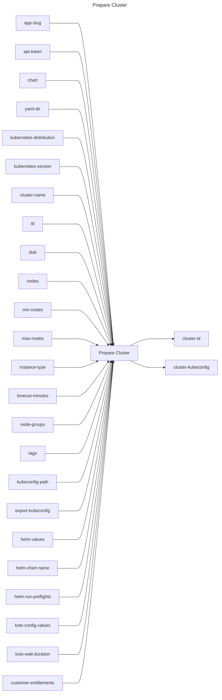

## Prepare Cluster

## Inputs
| Name | Default | Required | Description |
| --- | --- | --- | --- |
| app-slug |  | True | App Slug. |
| api-token |  | True | API Token. |
| chart |  | False | Path to the helm chart (One of `chart` or `yaml-dir` is required). |
| yaml-dir |  | False | The directory containing multiple yamls for a Replicated release. |
| kubernetes-distribution |  | True | Kubernetes distribution of the cluster to provision. |
| kubernetes-version |  | False | Kubernetes version to provision (format is distribution dependent). |
| cluster-name |  | False | Name of the cluster to provision |
| ttl |  | False | Cluster TTL (duration, max 48h) |
| disk |  | False | Disk size in GiB |
| nodes |  | False | Number of nodes to provision |
| min-nodes |  | False | Minimum number of nodes to provision |
| max-nodes |  | False | Maximum number of nodes to provision |
| instance-type |  | False | Instance type to provision |
| timeout-minutes | 20 | False | Time to wait for the cluster to have a status of `running` |
| node-groups |  | False | Node groups to provision. Example: <pre>node-groups: \|   - name: "worker"     instance-type: "t3.medium"     disk: 100     nodes: 3</pre>  |
| tags |  | False | Tags to assign to the cluster. Example: <pre>tags: \|   - key: "department"     value: "engineering"</pre>  |
| kubeconfig-path |  | False | If specified, the kubeconfig will be written to this path |
| export-kubeconfig | false | False | Export the KUBECONFIG variable (true/false) |
| helm-values |  | False | A Helm values.yaml file to use |
| helm-chart-name |  | False | The name of the Helm chart to use |
| helm-run-preflights | true | False | Run preflight checks (true/false) |
| kots-config-values |  | False | The KOTS config values to use |
| kots-wait-duration |  | False | Timeout for KOTS to be used while waiting for individual components to be ready. must be in Go duration format (eg: 10s, 2m) (default "2m") |
| customer-entitlements |  | False | Entitlements to assign to the customer. Example: <pre>customer-entitlements: \|   - name: "number-of-users"     value: "10"</pre>.'  |

## Outputs
| Name | Description |
| --- | --- |
| cluster-id | Contains the cluster id. |
| cluster-kubeconfig | Contains the kubeconfig to connect with the cluster. |

