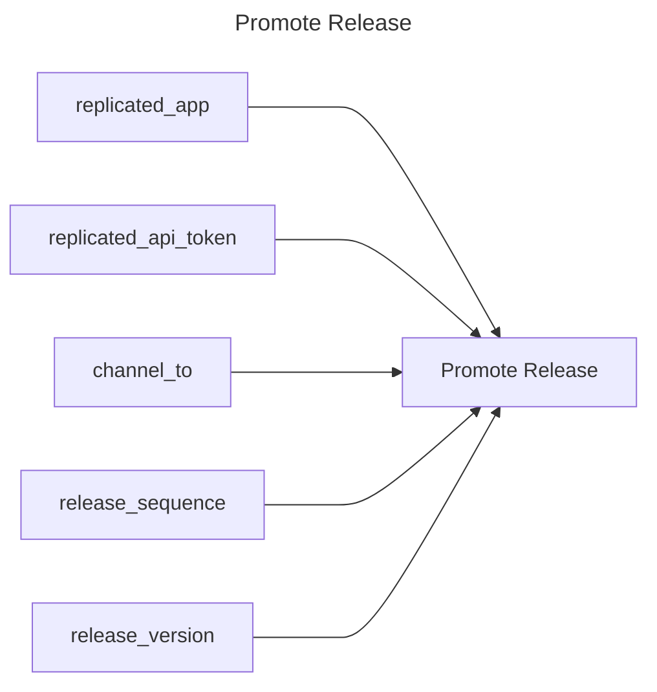

## Promote Release

## Inputs
| Name | Default | Required | Description |
| --- | --- | --- | --- |
| replicated-app |  | True | Replicated App Slug. |
| replicated-api-token |  | True | Replicated API Token. |
| channel-to |  | True | The name of the Channel to promote the release sequence to. |
| release-sequence |  | True | The release sequence number to promote. |
| release-version |  | True | The version field of the Release to promote. |

## Outputs
| Name | Description |
| --- | --- |

