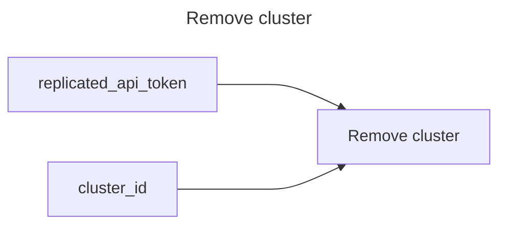

# Remove a cluster

## Inputs
| Name | Default | Required | Description |
| --- | --- | --- | --- |
| replicated-api-token |  | True | Replicated API Token. |
| cluster-id |  | True | Cluster id to remove. |

## Outputs
| Name | Description |
| --- | --- |