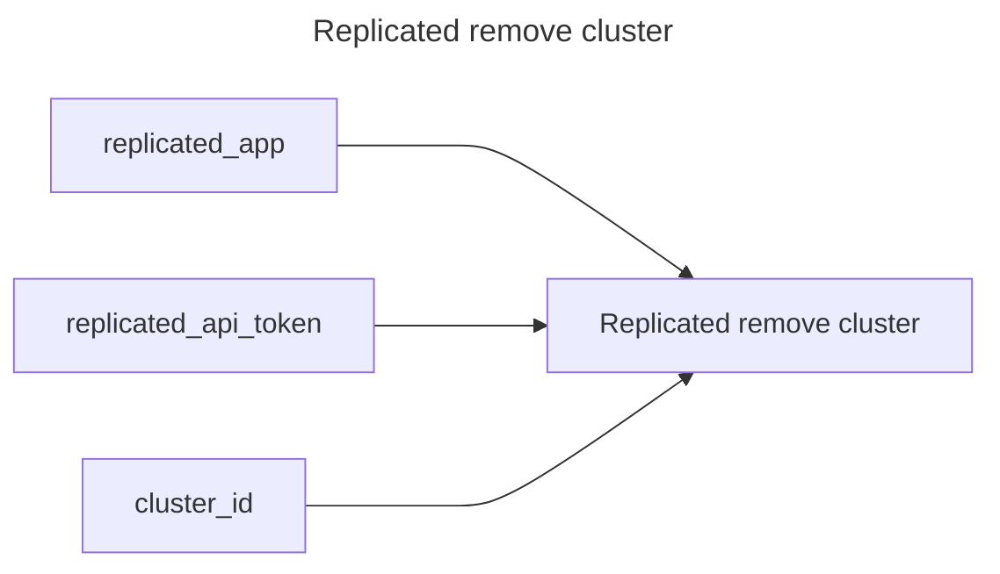

# Remove a cluster

```mermaid
---
title: Replicated remove cluster
---
graph LR
replicated_remove_cluster["Replicated remove cluster"]
replicated_app ---> replicated_remove_cluster
replicated_api_token ---> replicated_remove_cluster
cluster_id ---> replicated_remove_cluster
```