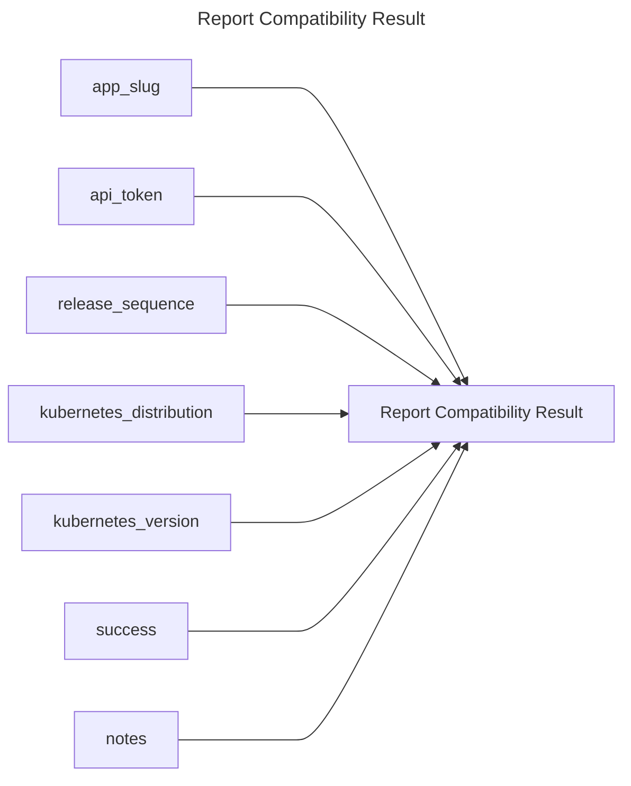

## Report Compatibility Result

## Inputs
| Name | Default | Required | Description |
| --- | --- | --- | --- |
| app-slug |  | True | App Slug. |
| api-token |  | True | API Token. |
| release-sequence |  | True | The release sequence number to report compatibility result for. |
| kubernetes-distribution |  | True | Kubernetes distribution of the cluster to report on. |
| kubernetes-version |  | True | Kubernetes version to report on (format is distribution dependent). |
| success |  | True | If set to true, the result will be marked as successfull. If set to false, the result will be marked as failed. (true/false) |
| notes |  | False | Notes for the compatibility result. |

## Outputs
| Name | Description |
| --- | --- |

