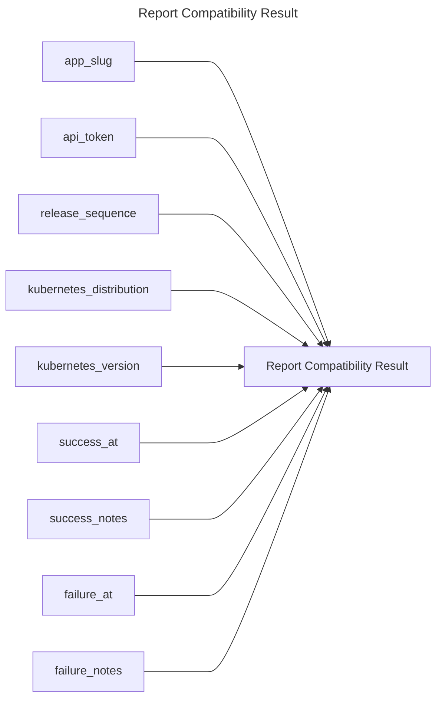

## Report Compatibility Result

## Inputs
| Name | Default | Required | Description |
| --- | --- | --- | --- |
| app-slug |  | True | App Slug. |
| api-token |  | True | API Token. |
| release-sequence |  | True | The release sequence number to report compatibility result for. |
| kubernetes-distribution |  | True | Kubernetes distribution of the cluster to report on. |
| kubernetes-version |  | True | Kubernetes version to report on (format is distribution dependent). |
| success-at |  | False | Timestamp for when the success compatibility result was reported (only success or failure can be used).  |
| success-notes |  | False | Notes for the success compatibility result (only success or failure can be used). |
| failure-at |  | False | Timestamp for when the failure compatibility result was reported (only success or failure can be used). |
| failure-notes |  | False | Notes for the failure compatibility result (only success or failure can be used). |

## Outputs
| Name | Description |
| --- | --- |

