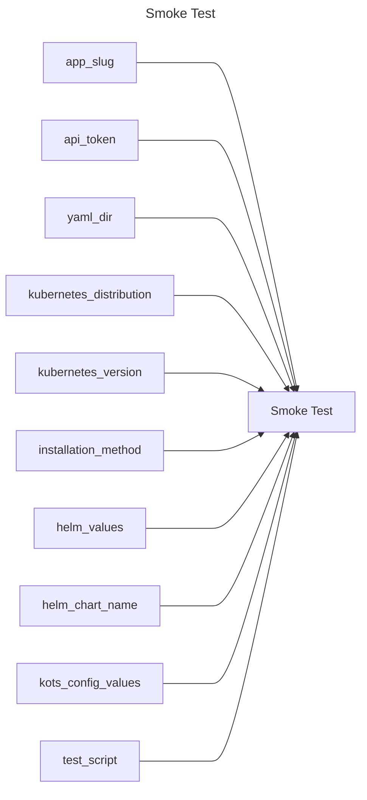

## Smoke Test

## Inputs
| Name | Default | Required | Description |
| --- | --- | --- | --- |
| app-slug |  | True | App Slug. |
| api-token |  | True | API Token. |
| yaml-dir | manifests | True | The directory containing multiple yamls for a Replicated release. |
| kubernetes-distribution |  | True | Kubernetes distribution of the cluster to provision. |
| kubernetes-version |  | True | Kubernetes version to provision (format is distribution dependent). |
| installation-method | helm | True | Method to install the application [helm|kots] (default: helm) |
| helm-values |  | False | A Helm values.yaml file to use |
| helm-chart-name |  | False | The name of the Helm chart to use |
| kots-config-values |  | False | The KOTS config values to use |
| test-script | test.sh | True | Location of the test script to run (default: test.sh) |

## Outputs
| Name | Description |
| --- | --- |

