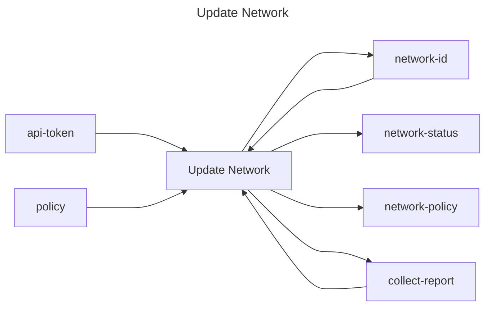

## Update Network

## Inputs
| Name | Default | Required | Description |
| --- | --- | --- | --- |
| api-token |  | True | API Token. |
| network-id |  | True | Network id to update. |
| policy |  | False | Network policy to set (e.g., `airgap`). At least one of `policy` or `collect-report` must be provided. |
| collect-report |  | False | Whether to collect a network report (true/false). At least one of `policy` or `collect-report` must be provided. |

## Outputs
| Name | Description |
| --- | --- |
| network-id | Contains the network id. |
| network-status | Contains the network status. |
| network-policy | Contains the network policy. |
| collect-report | Whether the network is collecting a report (true/false). |

