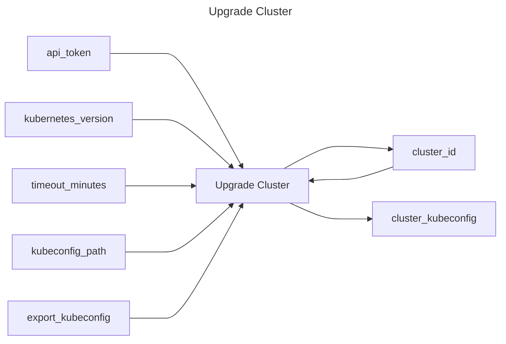

## Upgrade Cluster

## Inputs
| Name | Default | Required | Description |
| --- | --- | --- | --- |
| api-token |  | True | API Token. |
| cluster-id |  | True | Cluster id to upgrade. |
| kubernetes-version |  | True | Kubernetes version to provision (format is distribution dependent). |
| timeout-minutes | 20 | False | Time to wait for the cluster to have a status of `running` again |
| kubeconfig-path |  | False | If specified, the kubeconfig will be written to this path |
| export-kubeconfig | false | False | Export the KUBECONFIG variable (true/false) |

## Outputs
| Name | Description |
| --- | --- |
| cluster-id | Contains the cluster id. |
| cluster-kubeconfig | Contains the kubeconfig to connect with the cluster. |

